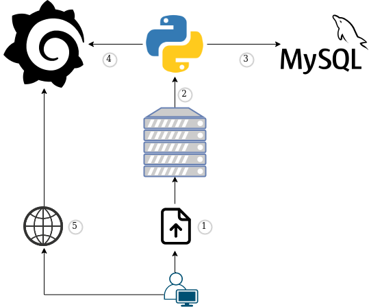
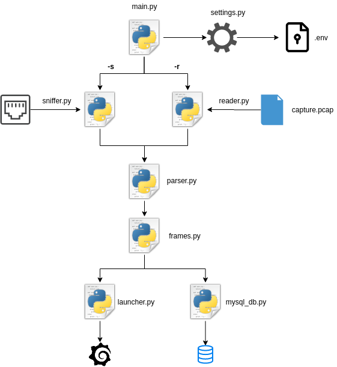

Resumen
===

Se pretende mejorar las prestaciones del prototipo analizador de tramas online que se presentó previamente. Esta necesidad surge del aumento del ancho de banda y la cantidad de datos que genera cada usuario, unido con el enorme incremento del despliegue de servicios e infraestructuras en la nube y la mejora de las herramientas disponibles.
Queriendo aprovechar estas circunstancias, se va a desarrollar una mejora para poder aprovechar al máximo los recursos disponibles en la actualidad, ofreciendo información mas detallada al usuario.
Para ello, se utilizarán nuevas herramientas para tratar de mejorar el proceso de almacenamiento de los datos (mezcla de bases de datos relacionales y no relacionales, como MySQL y Elasticsearch).
Para la visualización de estas tramas, se utilizarán herramientas como Grafana y Kibana, ya que ofrecen muchas métricas distintas y la posibilidad de configurar alertas personalizadas.

<div style="page-break-after: always; break-after: page;"></div>

- [Resumen](#resumen)
- [Introduccion](#introduccion)
- [Prototipo](#prototipo)
  - [Introduccion](#introduccion-1)
  - [Python](#python)
  - [MySQL](#mysql)
  - [Grafana](#grafana)
- [Tiempos](#tiempos)
  - [Introduccion](#introduccion-2)
  - [Tiempos de insercion](#tiempos-de-insercion)
  - [Tiempos de visualizacion](#tiempos-de-visualizacion)
- [Conclusiones](#conclusiones)

<div style="page-break-after: always; break-after: page;"></div>

<div style="page-break-after: always; break-after: page;"></div>

Introduccion
===
El constante crecimiento de las redes, tanto empresariales como domesticas, unido a la accesibilidad a una conexion y a un dispositivo ha provocado que cada vez se transmitan mas datos. Estos datos pueden ser almacenados en archivos o capturas de red que contienen distintos parametros que permiten obtener información sobre el tráfico que recorre una red. Debido a que el volumen de los datos por segundo puede ser muy elevado, son necesarias tecnicas de visualizacion que permitan obtener una imagen global sobre el trafico, bien en tiempo real o bien de un archivo. Es por ello que se pretende ofrecer una herramienta sencilla y accesible que permita obtener esta informacion de manera rapida y visual.

Previamente, se diseño un prototipo analizador de trazas online. En este caso, se ha decidido ofrecer otra solucion similar, pero destinada a obtener informacion global de la captura y no paquete a paquete.

<div style="page-break-after: always; break-after: page;"></div>

Prototipo
===

Introduccion
---
El prototipo consiste en un lector de capturas de tráfico de red que son procesadas, almacenadas en una base de datos MySQL y visualizadas mediante un panel de Grafana.


Figura 2.1: Flujo de funcionamiento del prototipo

- Paso 1: El usuario sube la captura de tráfico al servidor.
- Paso 2: Ejecuta el script de Python que procesa la captura.
- Paso 3: Introduce los paquetes en la base de datos.
- Paso 4: Añade la base de datos y el panel a Grafana.
- Paso 5: El usuario se conecta al servidor via web para ver el panel de Grafana.

Como se puede observar, este prototipo se compone de tres partes bien diferenciadas y que se van a explicar con detalle en los siguientes apartados:
- Python: Procesa los paquetes y los introduce en la base de datos.
- Base de datos: Almacena los paquetes de la captura.
- Grafana: Permite visualizar la captura.


Python
---
Es un lenguaje de programación interpretado, de alto nivel, dinámico y multiplataforma que soporta programación orientada a objetos. Se utiliza para prototipos y pruebas de
concepto, entre otros muchos usos, debido a su sencillez y a la gran cantidad de librerias existentes. Es por ello que se ha decidio utilizar este lenguaje para el desarrollo del prototipo.

Este prototipo procesa los paquetes para obtener la información necesaria y los almacena en la base de datos.
Los parámetros de interés de cada paquete son:
1. MAC origen
2. MAC destino
3. Ethertype
4. IP origen
5. IP destino
6. Protocolo
7. Puerto origen
8. Puerto destino
9. Timestamp

El prototipo dispone de dos modos de funcionamiento:
  - Sniffer de tráfico en tiempo real
  - Lector de capturas de tráfico


Figura 2.2: Flujo de funcionamiento del código de Python

Como se observa en la figura, el script obtiene las variables necesarias mediante el script _settings.py_. Independientemente del modo seleccionado, el código procesa los paquetes con la ayuda de los scripts _parser.py_ y _frames.py_. Posteriormente, introduce los paquetes en la base de datos mediante _mysql\_db.py_ y, finalmente, añade el panel y la base de datos a Grafana y ejecuta un navegador para visualizar los datos mediante _launcher.py_.


<!--
### Sniffer
Consiste en un **sniffer** de tráfico en tiempo real que utiliza la libreria [socket](https://docs.python.org/3/library/socket.html) para capturar los paquetes. Son procesados utilizando la clase **Parser** para extraer las cabeceras, crea un objeto **Packet** donde almacenarlas y, finalmente, inserta el paquete en la base de datos utilizando el driver **mysql_db**.

### Lector de capturas

Consiste en un lector de trazas que utiliza la libreria [libpcap](https://python-libpcap.readthedocs.io/en/latest/) para leer las trazas. Extrae las cabeceras y las introduce en un **Packet** de la misma manera que el _sniffer_. Almacena cada objeto en un array y, cuando esta completo, se insertan en la base de datos.
-->

MySQL
---
Es un gestor de bases de datos relacional de gran popularidad. Permite crear distintas bases de datos, tablas y usuarios para el correcto acceso y gestión de los datos almacenados.
Se ha diseñado una base de datos (OSniffy) con dos usuarios (OSniffy y OSniffy_Grafana) y una tabla (Packets) donde almacenar la información de los paquetes.

La tabla **Packets** se ha definido con los siguientes parámetros:
```sql
+-----------+----------------------+------+-----+-------------------+----------------+
| Field     | Type                 | Null | Key | Default           | Extra          |
+-----------+----------------------+------+-----+-------------------+----------------+
| packetID  | int(11)              | NO   | PRI | NULL              | auto_increment |
| srcMAC    | varchar(17)          | NO   |     | NULL              |                |
| dstMAC    | varchar(17)          | NO   |     | NULL              |                |
| etherType | varchar(6)           | NO   |     | NULL              |                |
| srcIP     | varchar(15)          | NO   |     | NULL              |                |
| dstIP     | varchar(15)          | NO   |     | NULL              |                |
| protocol  | tinyint(1) unsigned  | YES  |     | NULL              |                |
| srcPort   | smallint(2) unsigned | YES  |     | NULL              |                |
| dstPort   | smallint(2) unsigned | YES  |     | NULL              |                |
| timestamp | timestamp            | NO   |     | CURRENT_TIMESTAMP |                |
+-----------+----------------------+------+-----+-------------------+----------------+
```

El usuario **OSniffy** tiene todos los privilegios en la base de datos y es el encargado de insertar los datos.

```sql
+--------------------------------------------------------------+
| Grants for OSniffy@localhost                                 |
+--------------------------------------------------------------+
| GRANT USAGE ON *.* TO 'OSniffy'@'localhost'                  |
| GRANT ALL PRIVILEGES ON `OSniffy`.* TO 'OSniffy'@'localhost' |
+--------------------------------------------------------------+
```
El usuario **OSniffy_Grafana** tiene permiso de lectura a la base de datos y es el encargado de hacer las peticiones que serán visualizadas en Grafana.

```sql
+--------------------------------------------------------------+
| Grants for OSniffy_Grafana@localhost                         |
+--------------------------------------------------------------+
| GRANT USAGE ON *.* TO 'OSniffy_Grafana'@'localhost'          |
| GRANT SELECT ON `OSniffy`.* TO 'OSniffy_Grafana'@'localhost' |
+--------------------------------------------------------------+
```

Grafana
---
Es una aplicación web de código abierto y multiplataforma que permite visualizar y analizar de manera interactiva métricas almacenadas en distintas fuentes de datos. Sirve para  crear paneles de monitorizacion en tiempo real mediante gráficos, estadísticas, alertas personalizadas y consultas interactivas a las bases de datos.

Se ha diseñado un panel con dos secciones diferentes. La primera contiene información general sobre la traza y la segunda aporta más detalle.

- Paquetes por protocolo: Contiene el número de paquetes por protocolo (TCP/UDP/ICMP/ARP) 
- Nº de IPs y MACs: Muestra el número de direcciones IPs y direcciones MACs distintas en la traza
- Últimos 50 paquetes: Es un registro que muestra el detalle de los últimos 50 paquetes
- Paquetes por segundo: Cantidad de paquetes que se mandan por segundo
- IPs origen: Muestra las 5 direcciones IP origen que mas paquetes mandan
- IPs destino: Muestra las 5 direcciones IP destino que mas paquetes mandan
- Puertos origen: Muestra las 5 puertos origen que mas paquetes reciben
- Puertos destino: Muestra los 5 puertos destino que mas paquetes reciben

<div style="page-break-after: always; break-after: page;"></div>

Tiempos
===

Introduccion
---
Una vez que se ha definido la estructura y el funcionamiento del prototipo, se quiere analizar la capacidad de procesado y el tiempo necesario para visualizar las trazas. Se ha diferenciado el tiempo de almacenamiento de las trazas y el tiempo de visualización.


Tiempos de insercion
---
El proceso de insercion de los paquetes es el que mas tiempo consume. Se puede realizar de varias maneras distintas, aunque en este escenario se ha optado por probar dos:
    - Insertar los paquetes uno a uno: Cada vez que hay un paquete para insertar, se crea una nueva conexión a la base de datos, se añade y se cierra la conexion.
    - Insertar los paquetes en bloques: Se almacena un número de paquetes determinado y por cada bloque se crea una conexión a la base de datos, se añaden y se cierra la conexión.

Se han realizado varias pruebas para comprobar que metodo es mas eficiente y el número de paquetes optimo por bloque para reducir el tiempo de insercion. Se ha utilizado tres tipos de trazas: navegación web (59.635 paquetes, 39Mbs), video a 1080p (136.797 paquetes, 120Mb) y descarga de un fichero (1.061.088 paquetes, 1.1Gb) para poder abarcar tres de los escenarios más comunes.

|         | 1 paquete | 10 paquetes | 100 paquetes | 1.000 paquetes | 10.000 paquetes | 20.000 paquetes | 50.000 paquetes | 100.000 paquetes |
|:-------:|:---------:|:-----------:|:------------:|:--------------:|:---------------:|:---------------:|:---------------:|:----------------:|
|**39Mb** |  150.07s  |   27.68s    |   11.08s     |     8.35s      |     7.40s       |      9.02s      |       7.63s     |       6.78s      |
|**120Mb**|  443.89s  |  114.98s    |   39.17s     |    19.52s      |    19.21s       |      20.0s      |      19.20s     |      18.05s      |
|**1Gb**  | 3599.27s  |  865.21s    |  323.95s     |    165.18s     |   137.14s       |     140.2s      |     124.38s     |     118.88s      |

Mediante estos experimentos, se observa que la manera más eficiente de insertar los datos es en bloques de 100.000 paquetes, ya que reduce en gran medida el número de conexiones a realizar en la base de datos.


Tiempos de visualizacion
---
Grafana utiliza sentencias de MySQL para obtener los datos y poder visualizarlos. Es por ello que el tiempo necesario para poder visualizar los datos se ve influido por la complejidad de las busquedas y el número de registros en las tablas de la base de datos. Se ha analizado las distintas gráficas y peticiones para poder detectar cuales consumen mas tiempo.

|                     |         |Paquetes por protocolo | Nº de IPs y MACs | Ultimos 50 paquetes | Paquetes por segundo | IPs origen | IPs destino | Puertos origen | Puertos destino |
|:-------------------:|:-------:|:---------------------:|:----------------:|:-------------------:|:--------------------:|:----------:|:-----------:|:--------------:|:---------------:|
|Tiempo **peticiones**|**39Mb** |      186ms            |       394ms      |       300ms         |        298ms         |   398ms    |    327ms    |      244ms     |     297ms       |
|Tiempo **procesado** |**39Mb** |        2ms            |        <1ms      |         1ms         |         <1ms         |    1ms     |     <1ms    |        1ms     |      <1ms       |
|Tiempo **peticiones**|**120Mb**|      318ms            |       493ms      |       531ms         |        468ms         |   646ms    |    645ms    |      420ms     |     411ms       |
|Tiempo **procesado** |**120Mb**|        3ms            |        <1ms      |         1ms         |         <1ms         |    <1ms    |     <1ms    |       <1ms     |      <1ms       |
|Tiempo **peticiones**|**1Gb**  |      1.02s            |       2.44s      |       2.43s         |        2.46s         |   2.83s    |    2.84s    |      1.46s     |     1.56s       |
|Tiempo **procesado** |**1Gb**  |        2ms            |        <1ms      |        <1ms         |         <1ms         |   <1ms     |     <1ms    |       <1ms     |      <1ms       |

Como se puede observar, el tiempo de respuesta de las peticiones es el más elevado y aumenta considerablemente en función de la cantidad de datos almacenados y la complejidad de las peticiones.

<div style="page-break-after: always; break-after: page;"></div>

Conclusiones
===
Mediante este prototipo, cualquier usuario sin grandes conocimientos puede obtener información visual y detallada sobre una captura de tráfico en un tiempo aceptable. El proceso de procesado y almacenamiento de los paquetes es el mas costoso. Es por ello que para optimzar el proceso es necesario traducir el código de Python a C/C++ para reducir los tiempos de procesado. Hay que destacar que una base de datos relacional es potente y muy rápida con un número reducido de entradas, pero se observa que con grandes trazas el tiempo de indexado y las consultas empiezan a ser muy constosas. Es por ello que se podría optar por bases de datos no relacionales para permitir la optimización de la obtención y almacenamiento de datos.

Ademas, es un prototipo muy limitado, ya que solo tiene en cuenta 4 protocolos, aunque se pueden añadir mas con pequeñas modificaciones del código.
