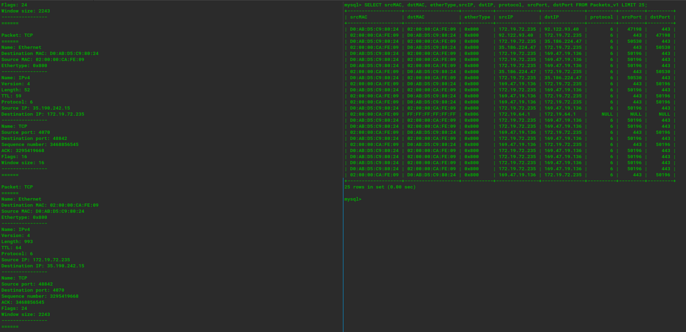
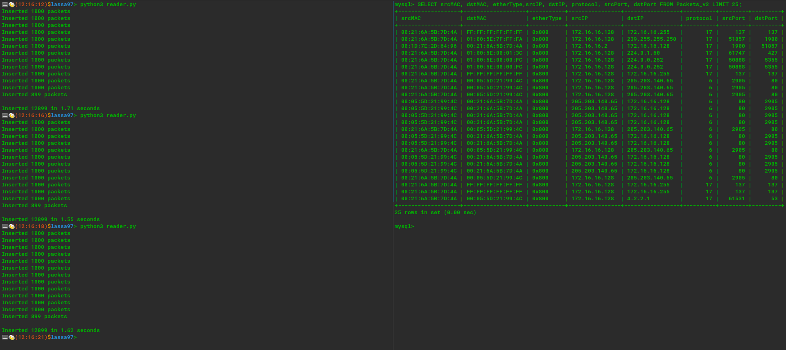
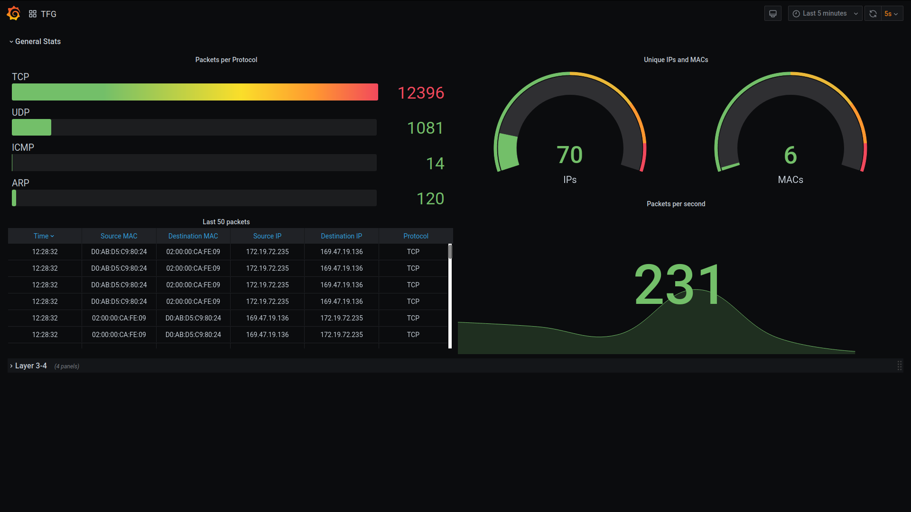
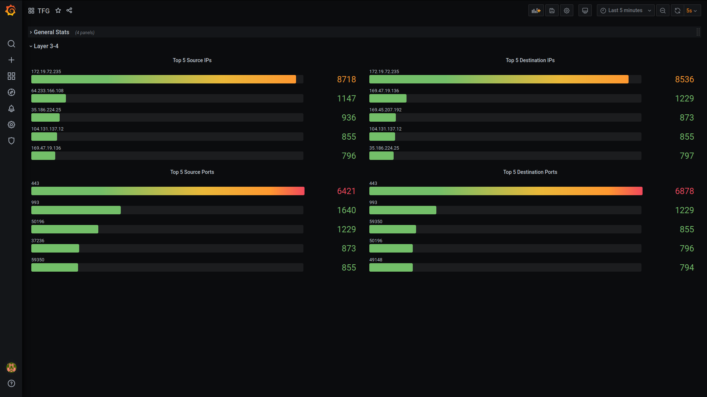

Resumen
===

Se pretende mejorar las prestaciones del prototipo analizador de tramas online que se presentó previamente. Esta necesidad surge del aumento del ancho de banda y la cantidad de datos que genera cada usuario, unido con el enorme incremento del despliegue de servicios e infraestructuras en la nube y la mejora de las herramientas disponibles.
Queriendo aprovechar estas circustancias, se va a desarrollar una mejora para poder aprovechar al máximo los recursos disponibles en la actualidad, ofreciendo información mas detallada al usuario.
Para ello, se utilizarán nuevas herramientas para tratar de mejorar el proceso de almacenamiento de los datos (mezcla de bases de datos relacionales y no relacionales, como MySQL y Elasticsearch).
Para la visualización de estas tramas, se utilizarán herramientas como Grafana y Kibana, ya que ofrecen muchas métricas distintas y la posibilidad de configurar alertas personalizadas.


Sistema online de disección de protocolos en trazas de paquetes
===

El escenario diseñado consiste en un servidor que contiene el código, el panel de Grafana y una base de datos MySQL. El cliente tiene dos opciones, subir una captura de tráfico o visualizar el tráfico en tiempo real.

Los datos que se procesan de cada paquete son:
    1. ID de paquete
    2. MAC origen
    3. MAC destino
    4. Ethertype
    5. IP origen
    6. IP destino
    7. Protocolo
    8. Puerto origen
    9. Puerto destino
    10. Timestamp

En función del modo de uso, la manera de procesar los paquetes varia ligeramente:
    - Tiempo real: Se procesa el paquete y se inserta en la base de datos uno a uno.
    - Lectura de captura: Se procesan los paquetes y se insertan en bloques de 10.000.

El prototipo diseñado consiste en dos modos de funcionamiento y utiliza un panel de Grafana para poder visualizar los datos de tráfico de red.

Los dos modos de funcionamiento son:
- Sniffer de tráfico en tiempo real
- Lector de capturas de tráfico

Dependiendo del modo de uso, el escenario cambia ligeramente.

- Lector de capturas de tráfico:
    El usuario sube una captura de tráfico al servidor y ejecuta el lector. Cuando el lector termina, el cliente podrá conectarse via web al panel de Grafana para poder analizar la captura.

- Sniffer de tráfico real:
    El usuario se conecta via web para observar el panel de Grafana que contiene las estadísticas en tiempo real.

Prototipo de disección de protocolos en trazas de paquetes
---

El prototipo diseñado consiste en dos modos de funcionamiento y un panel de Grafana donde poder visualizar los datos de tráfico de red en tiempo real.

Los dos modos de funcionamiento son:
- Sniffer de tráfico en tiempo real
- Lector de capturas de tráfico

Sniffer
===

Consiste en un **sniffer** de tráfico en tiempo real (utilizando la libreria [socket](https://docs.python.org/3/library/socket.html)), procesa los paquetes utilizando la clase **Parser** para obtener las cabeceras Ethernet, IPv4, ICMP, TCP/UDP o ARP. Una vez procesadas las cabeceras, se añaden a un objeto **Packet**, que contiene las cabeceras extraidas y se introduce en la base de datos MySQL utilizando el driver **mysql_db**.

<div align="center">
    
    <p><i>Captura de pantalla con el <b>sniffer</b> en funcionamiento</i></p>
</div>

Reader
===

Consiste en un lector de trazas que extra las cabeceras y las introduce en un **Packet** de la misma manera que el _sniffer_. Almacena en un array **1000 paquetes** y cuando esta completo, se insertan en la base de datos MySQL reduciendo el número de llamadas a la base de datos.

<div align="center">
    
    <p><i>Captura de pantalla con el <b>reader</b> en funcionamiento</i></p>
</div>

Panel
===

Se ha diseñado un panel en Grafana que muestra el tráfico en tiempo real o la traza que se ha procesado para obtener información de manera sencilla y visual.

<div align="center">
    
    <p><i>Panel con las estadisticas generales</i></p>
    <br>
    
    <p><i>Panel con estadisticas capa 3-4</i></p>
    <p>
</div>


---------------------------
Prototipo
===

El prototipo diseñado consiste en un lector de capturas de tráfico de red que, tras ser procesadas, son almacenadas en una base de datos MySQL y se visualizan en un panel de Grafana.
Se compone de tres partes bien diferenciadas:
- Python: Lee el archivo, procesa los paquetes y los inserta en una base de datos MySQL.
- Base de datos MySQL: Almacena los paquetes de la captura.
- Grafana: Visualiza la captura almacenada en MySQL.


El prototipo diseñado consiste en un lector de capturas de tráfico de red que, tras ser procesadas, son almacenadas en una base de datos MySQL y puede ser visualizada en un panel de Grafana. También existe la posibilidad de capturar el tráfico en tiempo real y visualizarlo. Se va a explicar en detalle cada una de las partes del prototipo:

Código
---
Se ha escrito en Python, ya que es un lenguaje de alto nivel que permite la creacción de prototipos y pruebas de concepto de manera rápida y sencilla. Procesa los paquetes para obtener la información necesaria y los almacena en la base de datos.
Los parámetros de interés de cada paquete son:
1. MAC origen
2. MAC destino
3. Ethertype
4. IP origen
5. IP destino
6. Protocolo
7. Puerto origen
8. Puerto destino
9. Timestamp

Este prototipo filtra los paquetes en función del protocolo y unicamente almacena los paquetes ARP, ICMP o TCP/UDP.

Se ha creado un archivo que contiene las variables de entorno necesarias donde se ha de introducir valores sensibles como usuarios y contraseñas, necesarios para el correcto funcionamiento del programa.

```
MYSQL_HOST="Direccion IP del servidor de MySQL"
DB_NAME="Nombre de la base de datos"
TABLE_NAME="Nombre de la tabla de la base de datos"


MYSQL_USER="Usuario de MySQL con privilegios para escribir en TABLE_NAME"
MYSQL_PASS="Contraseña"

MYSQL_USER_GRAFANA="Usuario de MySQL con privilegios de lectura en TABLE_NAME"
MYSQL_PASS_GRAFANA="Contraseña"

GRAFANA_HOST="Direccion IP del servidor de Grafana"
GRAFANA_PORT=Puerto de Grafana
GRAFANA_API_KEY="API Key de Grafana para añadir la base de datos"

CLIENT="Usuario del ordenador"
```

Base de datos
---
Se ha utilizado una base de datos relacional MySQL para el almacenamiento de los datos.

```sql
+-----------+----------------------+------+-----+-------------------+----------------+
| Field     | Type                 | Null | Key | Default           | Extra          |
+-----------+----------------------+------+-----+-------------------+----------------+
| packetID  | int(11)              | NO   | PRI | NULL              | auto_increment |
| srcMAC    | varchar(17)          | NO   |     | NULL              |                |
| dstMAC    | varchar(17)          | NO   |     | NULL              |                |
| etherType | varchar(6)           | NO   |     | NULL              |                |
| srcIP     | varchar(15)          | NO   |     | NULL              |                |
| dstIP     | varchar(15)          | NO   |     | NULL              |                |
| protocol  | tinyint(1) unsigned  | YES  |     | NULL              |                |
| srcPort   | smallint(2) unsigned | YES  |     | NULL              |                |
| dstPort   | smallint(2) unsigned | YES  |     | NULL              |                |
| timestamp | timestamp            | NO   |     | CURRENT_TIMESTAMP |                |
+-----------+----------------------+------+-----+-------------------+----------------+
```

Ya que se va a trabajar con una gran cantidad de entradas y se conoce el tamaño de cada uno de los campos, se ha decidido utilizar la memoria justa para cada parametro, evitando uso innecesario de memoria, optimizando los tiempos de insercion y de busqueda.

Contiene dos usuarios:
- OSniffy: Tiene todos los privilegios en la base de datos 'OSniffy'. Es el encargado de insertar los paquetes de datos.

```sql
+--------------------------------------------------------------+
| Grants for OSniffy@localhost                                 |
+--------------------------------------------------------------+
| GRANT USAGE ON *.* TO 'OSniffy'@'localhost'                  |
| GRANT ALL PRIVILEGES ON `OSniffy`.* TO 'OSniffy'@'localhost' |
+--------------------------------------------------------------+
```

- OSniffy\_Grafana: Tiene acesso de lectura a la base de datos 'OSniffy'. Solo puede hacer peticiones SELECT y sirve para poder visualizar los datos en Grafana.

```sql
+--------------------------------------------------------------+
| Grants for OSniffy_Grafana@localhost                         |
+--------------------------------------------------------------+
| GRANT USAGE ON *.* TO 'OSniffy_Grafana'@'localhost'          |
| GRANT SELECT ON `OSniffy`.* TO 'OSniffy_Grafana'@'localhost' |
+--------------------------------------------------------------+
```
